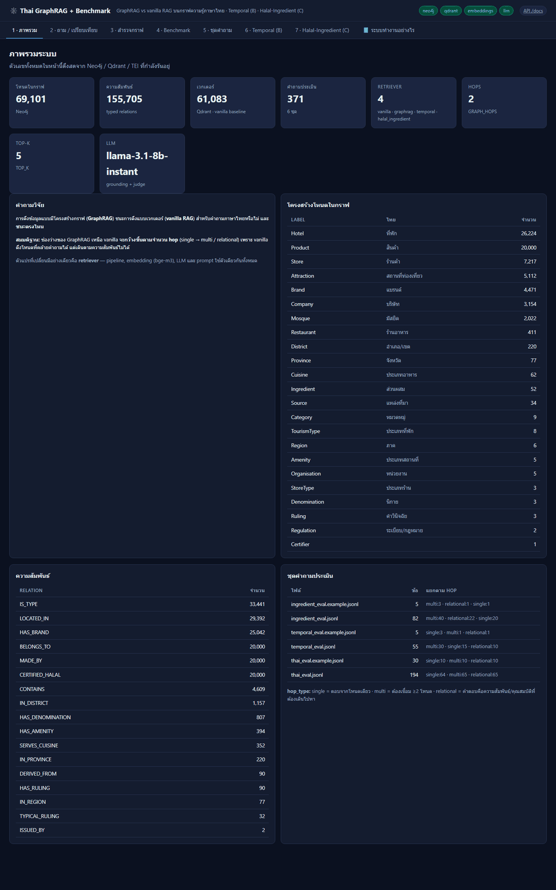

# 🕸️ Thai GraphRAG + Benchmark

**GraphRAG vs vanilla RAG บนกราฟความรู้ภาษาไทย — benchmark ที่วัดผลแยกตามจำนวน hop**
*A controlled study of graph-structured vs dense retrieval for Thai KGQA, with Temporal (B) and Halal-Ingredient (C) extensions.*


> **หนึ่งคำสั่งจบ:** `docker compose up --build -d` → UI ที่ http://localhost:8000

---

## 📌 คำถามวิจัยและสมมติฐาน

**ปัญหา** — ระบบถาม-ตอบภาษาไทยส่วนใหญ่ใช้ **vanilla RAG**: ฝังคำถามเป็นเวกเตอร์แล้วค้นเอกสาร
ที่คล้ายที่สุด วิธีนี้ได้ผลดีเมื่อคำตอบอยู่ในเอกสารเดียว แต่ **เดินตามความสัมพันธ์ไม่ได้** —
คำถามอย่าง *"ในจังหวัดเดียวกับมัสยิดกรือเซะ มีที่พักกี่แห่ง"* ต้องเชื่อมสองเอนทิตีผ่านโหนดจังหวัด
ที่ใช้ร่วมกัน ซึ่งไม่มีเอกสารใดบรรจุคำตอบไว้ตรงๆ

**คำถามวิจัย** — การดึงข้อมูลแบบมีโครงสร้างกราฟ (GraphRAG) ชนะการดึงแบบเวกเตอร์หรือไม่
สำหรับภาษาไทย และ **ชนะตรงไหน**

**สมมติฐาน (H1)** — ช่องว่างของ GraphRAG เหนือ vanilla จะ **กว้างขึ้นตามจำนวน hop**
(single → multi → relational) ตามที่มีรายงานในภาษาอังกฤษ (arXiv:2502.11371)

**ของใหม่ที่งานนี้ปล่อยออกมา**
1. ชุดประเมิน **Thai multi-hop KGQA** แยก `hop_type` ชัดเจน — ทรัพยากรที่แทบไม่มีเป็นสาธารณะ
2. ตาราง **คำวินิจฉัยส่วนผสมฮาลาล 90 รายการ** ที่ผูกคำวินิจฉัยกับ *แหล่งที่มา* ไม่ใช่กับส่วนผสม

---

## 🏗️ สถาปัตยกรรม และกติกา "การเทียบต้องยุติธรรม"

```
                          ┌──────────────────────────────┐
   คำถามภาษาไทย  ────────▶│   pipeline/answer.py          │
                          │   retrieve → ground           │
                          │   ⚠ ห้าม branch ตาม retriever │
                          └───────┬──────────────┬────────┘
                                  │              │
                  ┌───────────────▼──┐        ┌──▼───────────────────────┐
                  │  RETRIEVER       │        │  core/llm.py             │
                  │  ตัวแปรเดียว      │        │  prompt + model + temp   │
                  │  ที่เปลี่ยน       │        │  เดียวกันทุกเงื่อนไข      │
                  └───────┬──────────┘        └──────────────────────────┘
        ┌─────────────────┼──────────────────┬──────────────────┐
        ▼                 ▼                  ▼                  ▼
  ┌──────────┐     ┌────────────┐   ┌─────────────┐   ┌──────────────────┐
  │ vanilla  │     │  graphrag  │   │  temporal   │   │ halal_ingredient │
  │ Qdrant   │     │  Neo4j     │   │  B: กรองปี   │   │ C: คืน PATH      │
  │ top-k    │     │  k-hop     │   │             │   │                  │
  └────┬─────┘     └─────┬──────┘   └──────┬──────┘   └────────┬─────────┘
       │                 │                 │                   │
       ▼                 ▼                 ▼                   ▼
  ┌─────────┐      ┌──────────────────────────────────────────────┐
  │ Qdrant  │      │            Neo4j (กราฟความรู้)                │
  │ bge-m3  │      │  Place → Province → Region                    │
  │ 1024d   │      │  Product → Category / Company                 │
  └─────────┘      │  Ingredient → Source → Ruling                 │
                   └──────────────────────────────────────────────┘
```

**กติกาที่บังคับไว้ในโค้ดจริง 3 ข้อ** — ถ้าข้อใดพัง ผลการทดลองใช้ไม่ได้:

1. **`pipeline/answer.py` ห้าม branch ตาม `retriever.name`** — system prompt, model และ
   temperature อยู่ที่ `core/llm.py` ที่เดียว ใช้ร่วมกันทุกเงื่อนไข
2. **GraphRAG ห้ามแตะ Qdrant** — entity linking เป็น lexical บน Neo4j ล้วน ถ้าปล่อยให้
   fallback ไปหา vector GraphRAG จะกลายเป็น superset ของ vanilla แล้วชัยชนะจะอธิบายได้
   ง่ายๆ ว่า *"มันมี baseline อยู่ในตัวด้วย"* ซึ่งไม่ใช่ผลของโครงสร้างกราฟ
3. **ทั้งสอง retriever ต้องเห็นโหนดชุดเดียวกัน** — `build_kg` เขียน Neo4j กับ Qdrant ในรอบ
   เดียวกัน และ extension ที่เพิ่มโหนดใหม่ต้องเรียก `index_labels()` ลง Qdrant ด้วย

นอกจากนี้ยังจำกัดความยาว context (`MAX_TRIPLES` ค่าเริ่มต้น 60 ข้อเท็จจริง) ด้วยเหตุผลเดียวกัน:
ถ้าปล่อยให้ GraphRAG เทกราฟทั้งก้อนลง prompt มันจะชนะเพราะ **งบ token** ไม่ใช่เพราะโครงสร้าง

รายละเอียดเต็ม: [`docs/METHODOLOGY.md`](docs/METHODOLOGY.md) (เหตุผลเชิงทดลอง) ·
**[`docs/HOW_IT_WORKS.md`](docs/HOW_IT_WORKS.md) (ระบบทำงานอย่างไร — มีไดอะแกรมอธิบายทีละขั้น
ว่า vanilla ต่างจาก GraphRAG ยังไง, GraphRAG มี 4 ขั้นอะไรบ้าง, และ A/B/C ต่อกันอย่างไร)**
หรือเปิดหน้า **"📘 ระบบทำงานอย่างไร"** ใน UI เพื่อดูไดอะแกรมแบบภาพ

---

## 🎬 System tour



<!-- RESULTS:SCREENSHOTS -->

---

<!-- RESULTS:FINDINGS -->

---

## 🐳 รันด้วยคำสั่งเดียว

```bash
cp .env.example .env      # ใส่ LLM_API_KEY แล้ววาง CSV ต้นทางไว้ใน ./data
docker compose up --build -d
```

ขึ้นครบ 4 service บูตครั้งแรก `app` จะ: รอ service พร้อม → สร้าง KG → สร้าง layer B/C →
รัน benchmark หนึ่งรอบ → แล้วจึงเสิร์ฟ

> **บูตครั้งแรกช้า** TEI ต้องโหลด bge-m3 ~2GB และการ embed ~61,000 โหนดบน CPU ใช้เวลา
> ราว 75 นาที รอบถัดไปตั้ง `SKIP_BOOTSTRAP=1` ใน `.env`

### คำสั่งที่ใช้บ่อย

```bash
docker compose logs -f app          # ดู bootstrap ทำงาน
docker compose ps                   # สถานะ + healthcheck
docker compose restart app          # รีสตาร์ทเฉพาะแอป
docker compose down                 # หยุด (ข้อมูลยังอยู่ใน volume)
docker compose down -v              # หยุดและลบข้อมูลทั้งหมด
```

### รันบนเครื่องเพื่อพัฒนา

```bash
docker compose up -d neo4j qdrant embeddings
pip install -r requirements.txt

python -m scripts.build_kg --reset
python -m scripts.build_temporal_kg
python -m scripts.build_ingredient_kg
python -m scripts.generate_eval --suite all
python -m scripts.run_benchmark --suite all --judge
pytest
uvicorn thaigraphrag.app.main:app --port 8000
```

### 🐛 บั๊กที่ต้องแก้เพื่อให้ระบบบูตและให้ผลถูกต้อง

ทั้งหมดนี้เจอจากการรันระบบจริง ไม่ใช่จากการอ่านโค้ด — และส่วนใหญ่ **ไม่ทำให้โปรแกรมพัง**
แต่ทำให้ผลลัพธ์แย่ลงอย่างเงียบๆ ซึ่งอันตรายกว่า

| # | อาการ | สาเหตุที่แท้จริง | วิธีแก้ |
|---|-------|-----------------|--------|
| 1 | `LOCATED_IN` แทบไม่เกิด → ไม่มีคำถาม multi-hop | `addr_province` มีข้อมูลแค่ ~4% ของโรงแรม, ~1.7% ของมัสยิด และ **0%** ของสถานที่ท่องเที่ยว | เพิ่ม `kg/provinces.py` — กู้จังหวัด 3 ชั้น: คอลัมน์ → ข้อความที่อยู่ → point-in-polygon จากพิกัด บันทึก `province_source` ไว้ตรวจย้อนได้ |
| 2 | KG build ล้มด้วย `413 Payload Too Large` | `EMBED_BATCH=64` เกิน `--max-client-batch-size` ของ TEI (ค่า default 32) | `embed_many` แบ่งครึ่ง batch อัตโนมัติเมื่อเจอ 413 + ตั้ง `--max-client-batch-size 64` ใน compose |
| 3 | GraphRAG ค้างเมื่อ seed เป็นโหนดจังหวัด | `MATCH path=(s)-[*1..2]-(m) ... LIMIT 200` ต้องไล่ path เป็นล้านเส้นก่อน LIMIT จะทำงาน (กรุงเทพฯ มีเพื่อนบ้าน 3,746 โหนด) | เปลี่ยนเป็น aggregate ที่ฐานข้อมูล (`count` + `collect(...)[0..5]`) — หนึ่งแถวต่อประเภทความสัมพันธ์ |
| 4 | seed แรกของ *"มัสยิด**กลาง**ปัตตานี"* คือ Region "กลาง" | ชื่อภาคเป็นคำไทยธรรมดา จับกลางคำได้ | บังคับ prefix — Region ต้องมาคู่กับ "ภาค", District ต้องมาคู่กับ "อำเภอ/เขต" |
| 5 | entity linking ใช้เวลา **8.2 วินาที** | fallback ยิง Cypher หนึ่งครั้งต่อ n-gram โดยไม่จำกัด | จำกัดที่ 12 span → 0.8 วินาที |
| 6 | ชื่อสั้นอย่าง `Mooz` หา**ไม่เจอเลย** ทั้งที่โหนดมีอยู่ | การจำกัด 12 span เอา span ที่ยาวที่สุดก่อน ซึ่งเป็น substring ไทย 12 ตัวอักษรทั้งหมด จึงไม่เคยไปถึงชื่อ 4 ตัวอักษร | เรียง token ที่คั่นด้วยช่องว่างขึ้นก่อน n-gram |
| 7 | fulltext index ใช้ไม่ได้กับภาษาไทย | โค้ดตัด query ด้วยช่องว่างก่อนส่ง Lucene — ภาษาไทยไม่มีช่องว่าง คำถามทั้งประโยคจึงกลายเป็น term เดียวยาว 60 ตัวอักษร | สร้าง index ด้วย analyzer `thai` แล้วส่ง query **ดิบ** ให้ Lucene ตัดคำเอง (1071ms → 145ms) |
| 8 | เกณฑ์ความยาวชื่อประเมินคำไทยเกินจริง | `len("น่าน") == 4` เพราะ Python นับวรรณยุกต์/สระเป็นตัวอักษรแยก จังหวัดอย่าง "เลย" "ตาก" จึงหลุด guard | เขียน `thai_len()` ที่ไม่นับ combining marks |
| 9 | คำถามเรื่องกรุงเทพฯ ดึง *"มัสยิดกลางจังหวัดยะลา"* มาเป็น seed | คำว่า "จังหวัด" ถูกนับเป็น overlap ที่ยาวพอ | ไม่ให้ stopword/คำหมวดหมู่นับเป็น overlap + ตัด seed ที่คะแนนต่ำกว่า 75% ของอันดับหนึ่ง |
| 10 | extension เพิ่มโหนดใน Neo4j อย่างเดียว | `Ingredient`/`Source`/`Ruling` ไม่มีใน Qdrant → vanilla มองไม่เห็น = **การเทียบไม่ยุติธรรม** | เพิ่ม `index_labels()` ให้ทุก extension เรียกหลัง build |
| 11 | Neo4j เตือน "relationship type does not exist" ทุก query | extension เป็น layer ที่อาจยังไม่ถูกสร้าง | ปิด notification คลาส `UNRECOGNIZED` ที่ driver |
| 12 | โหนด District ชื่อ "เมือง" ชนกันทั้งประเทศ | constraint unique อยู่บน `name` แต่ "เมือง" มี 77 อำเภอ | เปลี่ยน key เป็น `district\|province` |
| 13 | `python -m scripts.build_kg --reset` ไม่สนใจ flag | script wrapper เรียก `build()` ตรงๆ ไม่ผ่าน argparse | ให้ wrapper เรียก `main()` |
| 14 | TEI ถูก OOM-kill ตอน warmup | bge-m3 รับ input ได้ 8192 token, default `--max-batch-tokens 16384` ทำให้จองหน่วยความจำ >15GB | จำกัดที่ 2048 + `--auto-truncate` (แนวเดียวกับ Chatbot-CoreEngine) |

---

## 🔗 SYSTEM LINKS MAP

ทุก URL ที่ระบบเปิดให้เมื่อรันอยู่ — copy ไปวางได้เลย

| URL | คืออะไร |
|-----|---------|
| http://localhost:8000 | **Demo UI** — 7 หน้า |
| http://localhost:8000/#overview | 1 · ภาพรวม + ตัวเลขสด |
| http://localhost:8000/#ask | 2 · ถาม / เปรียบเทียบ vanilla vs GraphRAG |
| http://localhost:8000/#kg | 3 · สำรวจกราฟ + graph view |
| http://localhost:8000/#benchmark | 4 · รัน benchmark + ตาราง + กราฟ |
| http://localhost:8000/#eval | 5 · ดู/แก้ชุดคำถาม |
| http://localhost:8000/#temporal | 6 · Temporal (B) — เลือกปี พ.ศ. |
| http://localhost:8000/#ingredient | 7 · Halal-Ingredient (C) — เส้นทางคำวินิจฉัย |
| http://localhost:8000/#how | 📘 ระบบทำงานอย่างไร — ไดอะแกรมอธิบายทั้งระบบ |
| http://localhost:8000/docs | **Swagger** (OpenAPI) |
| http://localhost:8000/health | สถานะ dependency ทั้งหมด |
| http://localhost:8000/api/stats | ตัวเลขกราฟ/เวกเตอร์/ชุดคำถาม (JSON) |
| http://localhost:8000/figures/f1_by_hop.png | กราฟผลหลัก |
| http://localhost:7474 | **Neo4j Browser** (neo4j / `NEO4J_PASSWORD`) |
| bolt://localhost:7687 | Neo4j bolt |
| http://localhost:6333/dashboard | **Qdrant dashboard** |
| http://localhost:8080 | **TEI** (bge-m3) — `/health`, `/embed` |

### REST API

| Method | Endpoint | ทำอะไร |
|--------|----------|--------|
| `POST` | `/api/ask` | ถามหนึ่งคำถามด้วยหลาย retriever พร้อมกัน |
| `GET` | `/api/link` | ดู entity-linking trace ว่าคำถามผูกกับโหนดใด และผูกด้วยวิธีไหน |
| `GET` | `/api/kg/search` | ค้นโหนดตามชื่อ/label |
| `GET` | `/api/kg/node/{id}` | รายละเอียดโหนด + เพื่อนบ้าน |
| `GET` | `/api/kg/graph` | subgraph รอบคำค้น (สำหรับวาดกราฟ) |
| `POST` | `/api/benchmark/run` | สั่งรัน benchmark (ทำงานเบื้องหลัง) |
| `GET` | `/api/benchmark/status` | สถานะการรัน |
| `GET` | `/api/benchmark/results` | สรุป + รายข้อ + รายการรูป |
| `GET` `PUT` | `/api/eval/{file}` | อ่าน/บันทึกชุดคำถาม |
| `POST` | `/api/temporal/ask` | ถามแบบระบุปี พ.ศ. เทียบกับ baseline ที่ไม่รู้เรื่องเวลา |
| `GET` | `/api/temporal/coverage` | ความครอบคลุมของข้อมูลเวลา |
| `POST` | `/api/ingredient/explain` | เส้นทาง ส่วนผสม → แหล่งที่มา → คำวินิจฉัย |
| `GET` | `/api/ingredient/list` | ฐานคำวินิจฉัยทั้งหมด |

---

## 🔬 โครงสร้างงานวิจัย — A / B / C ประกอบกันอย่างไร

**A (แกน)** รันได้ลำพัง ไม่ต้องมี B หรือ C
**B และ C** เสียบผ่าน `retrievers.get_retriever` และเพิ่มตัวเองเข้า suite ของ benchmark —
**ไม่มีไฟล์ใน core ถูกแก้เพื่อให้ extension ทำงาน**

| suite | retriever ที่เทียบ | ชุดคำถาม | สิ่งที่รายงาน |
|-------|-------------------|----------|--------------|
| `core` | vanilla · graphrag | `thai_eval.jsonl` | F1 แยกตาม hop |
| `temporal` | vanilla · graphrag · **temporal** | `temporal_eval.jsonl` | % ลดคำตอบผิดยุค |
| `ingredient` | vanilla · graphrag · **halal_ingredient** | `ingredient_eval.jsonl` | correctness + ความสมบูรณ์ของเส้นทาง |

รันแยกกันได้:

```bash
python -m scripts.run_benchmark --suite core        # A อย่างเดียว
python -m scripts.run_benchmark --suite temporal    # B
python -m scripts.run_benchmark --suite ingredient  # C
```

ลบโฟลเดอร์ `extensions/temporal/` ทิ้งแล้ว A ยังรันได้ปกติ — `get_retriever` ใช้ lazy import
และ `available_retrievers()` รายงานเฉพาะตัวที่สร้างได้จริง

---

## 🗂️ FILE DIRECTORY

โครงสร้างไฟล์แบบเต็มพร้อมคำอธิบายทีละไฟล์อยู่ที่ **[`FILE_DIRECTORY.md`](FILE_DIRECTORY.md)**

สรุปย่อ:

```
thaigraphrag/
├── app/          FastAPI + SPA 7 หน้า (ทุก endpoint ยิงระบบจริง)
├── core/         embeddings · llm · neo4j · qdrant · entity_linking
├── kg/           provinces (geocode) · schema (declarative) · build_kg (engine)
├── retrievers/   base · vanilla · graphrag · get_retriever (จุดเสียบ extension)
├── pipeline/     answer.py — จุดที่รับประกันความยุติธรรมของการเทียบ
├── benchmark/    datasets · metrics · run_benchmark (3 suite)
└── extensions/   temporal (B) · halal_ingredient (C)

data/halal/       ⭐ ตารางคำวินิจฉัย 90 รายการ + ไทม์ไลน์ระเบียบ (commit ไว้)
data/questions/   ⭐ ชุดประเมิน — สร้างจากกราฟ ไม่ได้เขียนมือ
scripts/          build_* · generate_eval · run_benchmark · bootstrap · capture_screenshots
tests/            67 tests ไม่ต้องต่อ service ใดๆ
```

---

## 📚 อ้างอิง

ดู [`docs/REFERENCES.md`](docs/REFERENCES.md) — RAG vs GraphRAG, TG-RAG/ECT-QA,
NodeRAG/LightRAG, OpenThaiGPT ฯลฯ

## 📄 License

**[View-only](LICENSE)** © 2026 Hally Palalay — ดูและอ้างอิงเพื่อประเมินผลงาน/งานวิจัยได้
ไม่อนุญาตให้นำโค้ดหรือชุดข้อมูลไปใช้ คัดลอก ดัดแปลง หรือเผยแพร่ต่อโดยไม่ได้รับอนุญาต

> ⚠️ **ตารางคำวินิจฉัยส่วนผสมในงานนี้เป็น research artefact ไม่ใช่คำฟัตวา**
> ข้อที่มีทัศนะต่างกันระหว่างสำนักคิดถูกจัดเป็น `mashbooh` พร้อมหมายเหตุ ไม่ได้ตัดสินให้
> คอลัมน์ `basis_th` ระบุเหตุผลของทุกแถว การตัดสินใจจริงต้องอ้างอิงหน่วยงานรับรองที่มีอำนาจ
