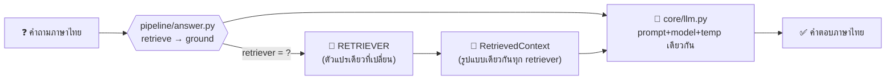
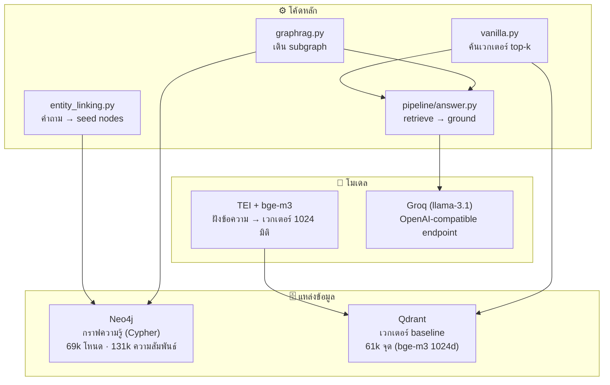
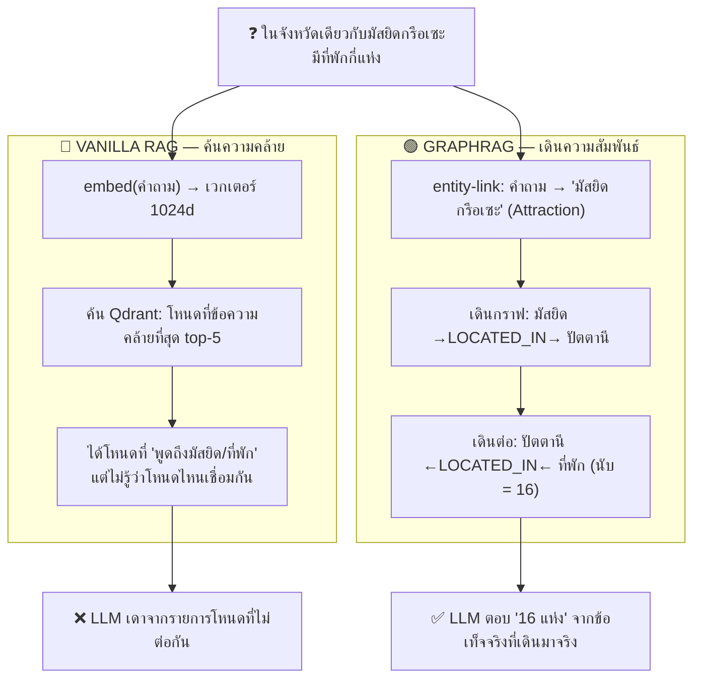
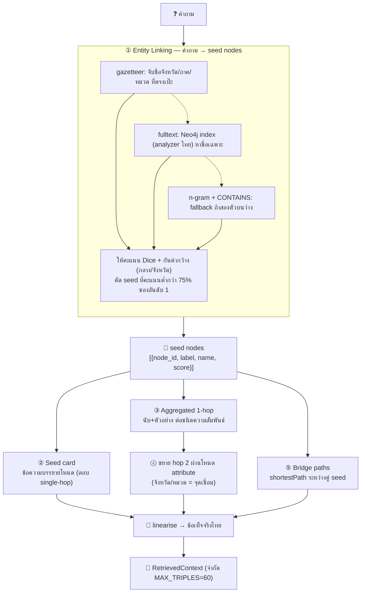
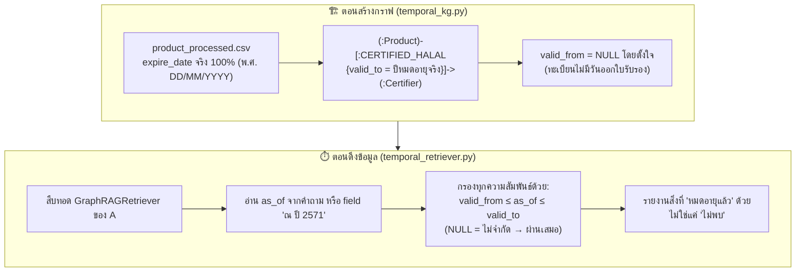
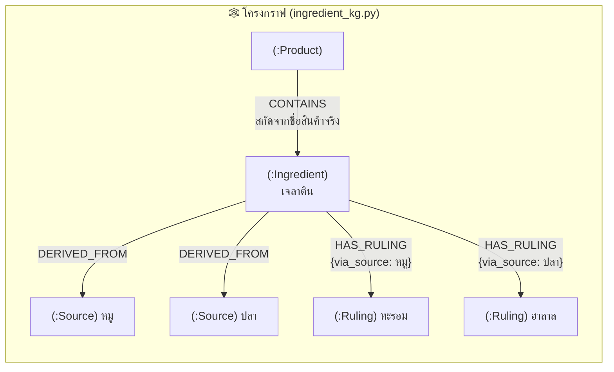
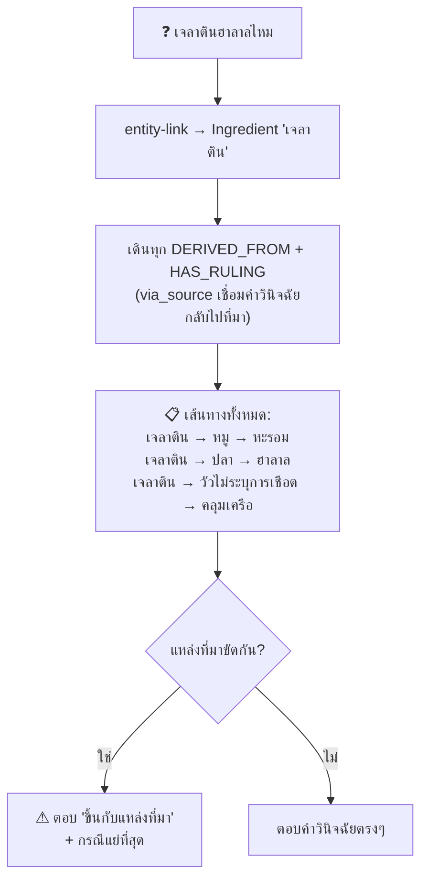
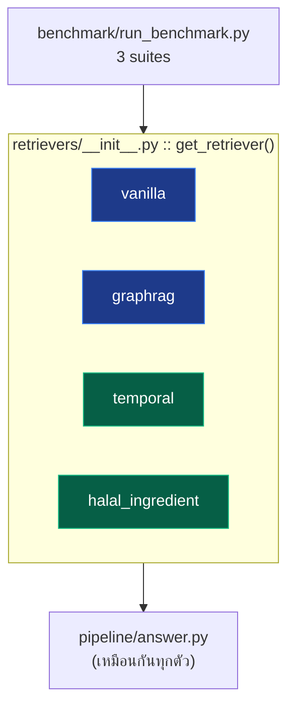
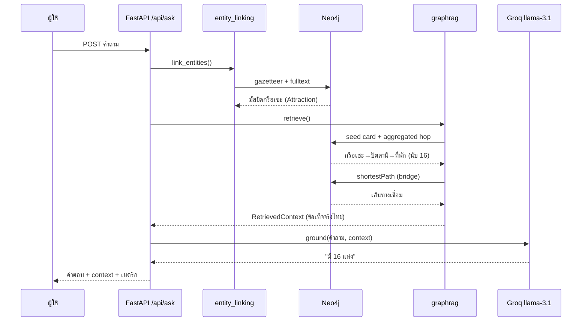

# 🧭 ระบบทำงานอย่างไร — How it works

คู่มืออธิบายการทำงานภายในของทั้งระบบ ตั้งแต่คำถามภาษาไทยเข้าไปจนได้คำตอบ
ว่าแต่ละส่วน **ใช้อะไร ทำอะไร และต่อกันอย่างไร** พร้อมความแตกต่างของ A / B / C

> อ่านคู่กับ [`METHODOLOGY.md`](METHODOLOGY.md) (เหตุผลเชิงทดลอง) และ
> [`../FILE_DIRECTORY.md`](../FILE_DIRECTORY.md) (ไฟล์ไหนทำอะไร)

---

## 1. ภาพรวม 30 วินาที

ระบบตอบคำถามภาษาไทยจาก **Knowledge Graph (KG)** โดยเปรียบเทียบ 2 วิธีดึงข้อมูล
บนกราฟเดียวกัน ด้วย LLM/embedding/prompt เดียวกัน — เปลี่ยนแค่ **ตัวดึงข้อมูล (retriever)**

| | ใช้อะไร | ทำอะไร |
|---|---------|--------|
| **Vanilla RAG** (baseline) | Qdrant + bge-m3 | ฝังคำถามเป็นเวกเตอร์ → ค้นโหนดที่ข้อความคล้ายที่สุด top-k |
| **GraphRAG** (แกนงานวิจัย) | Neo4j (Cypher) | จับเอนทิตีในคำถาม → เดินกราฟรอบๆ → เอา "ข้อเท็จจริงเชิงกราฟ" มาตอบ |

แล้ววัดผลด้วย **benchmark ที่แยกตามจำนวน hop** (single / multi / relational)
เพื่อพิสูจน์ว่า GraphRAG ได้เปรียบตรงคำถามหลายชั้นความสัมพันธ์



---

## 2. ส่วนประกอบ — ใช้อะไร ทำอะไร



| ส่วน | เทคโนโลยี | หน้าที่ในระบบ |
|------|-----------|----------------|
| **Knowledge Graph** | Neo4j (Cypher) | แหล่งความจริงเดียวของกราฟ — โหนดสถานที่/สินค้า + ความสัมพันธ์แบบมีชนิด |
| **Vector store** | Qdrant | เก็บเวกเตอร์ของข้อความโหนด สำหรับ baseline vanilla เท่านั้น |
| **Embeddings** | bge-m3 ผ่าน TEI (HTTP) | แปลงข้อความไทยเป็นเวกเตอร์ 1024 มิติ (local ไม่พึ่ง API ภายนอก) |
| **LLM** | Groq llama-3.1 (สลับ OpenThaiGPT ได้) | สรุปคำตอบจาก context + เป็นผู้ตัดสิน faithfulness |
| **Entity linking** | Cypher + gazetteer + fulltext | จับว่าคำถามพูดถึงโหนดใดในกราฟ |
| **Pipeline** | `answer.py` | จุดที่บังคับความยุติธรรม — retrieve แล้ว ground ด้วย prompt เดียว |
| **Benchmark** | pandas + matplotlib | รัน 3 suite แยกตาม hop → ตาราง + กราฟ |

**กติกาเหล็ก:** Neo4j = กราฟ · Qdrant = baseline เท่านั้น · ไม่มี secret hardcode
(อ่านจาก `.env` ผ่าน `config.py`) · `answer.py` ห้าม branch ตามชนิด retriever

---

## 3. A (แกน) — Vanilla RAG ต่างจาก GraphRAG อย่างไร

**นี่คือหัวใจของงานวิจัย** — ทั้งสองวิธีรับคำถามเดียวกัน คืน `RetrievedContext`
รูปแบบเดียวกัน ส่งให้ LLM ตัวเดียวกัน ต่างกันแค่ **วิธีหา context**



### ทำไม vanilla แพ้คำถามหลาย hop

Vanilla เก่งเรื่อง **ความคล้ายของข้อความ** — ถ้าคำตอบอยู่ในโหนดเดียวที่ข้อความคล้ายคำถาม
มันหาเจอ แต่คำถามที่ต้อง **เชื่อมสองโหนดผ่านโหนดที่สาม** (เช่น มัสยิด→จังหวัด→ที่พัก)
ไม่มีโหนดไหนบรรจุคำตอบไว้ตรงๆ vanilla จึงได้แค่โหนดที่ "พูดถึงคำในคำถาม" มากองรวมกัน
โดยไม่รู้ว่าโหนดไหนเชื่อมกัน ส่วน GraphRAG **เดินตามเส้นความสัมพันธ์จริง** จึงประกอบคำตอบได้

| | Vanilla RAG | GraphRAG |
|---|-------------|----------|
| หา context จาก | ความคล้ายเวกเตอร์ (Qdrant) | โครงสร้างกราฟ (Neo4j) |
| หน่วยที่ดึง | โหนดเดี่ยวๆ top-k | subgraph + เส้นทางเชื่อม |
| จุดแข็ง | คำถาม single-hop, ข้อความยาว | คำถาม multi-hop, นับ/รวม/เชื่อม |
| จุดอ่อน | เดินความสัมพันธ์ไม่ได้ | ต้อง entity-link ให้ถูกก่อน |
| context ที่ได้ | ข้อความโหนดต่อกัน | ข้อเท็จจริงเชิงกราฟ (triples + paths) |

---

## 4. ข้างใน GraphRAG — 4 ขั้นตอน

`graphrag.py` ทำงานเป็น 4 ขั้น หลังจาก entity linking คืน seed nodes มาแล้ว



### ทำไมต้อง "aggregate" ไม่ใช่ไล่ทุก path

รุ่นแรกใช้ `MATCH path=(s)-[*1..2]-(m) ... LIMIT 200` — พอ seed เป็นโหนด hub อย่าง
"จังหวัดกรุงเทพมหานคร" (เพื่อนบ้าน 3,746 โหนด) มันต้องไล่ path **เป็นล้านเส้น**
ก่อน LIMIT จะทำงาน → ค้าง ทางแก้คือ **aggregate ที่ฐานข้อมูล**: หนึ่งแถวต่อ
(ชนิดความสัมพันธ์ × ชนิดโหนดปลาย) พร้อม `count` + ตัวอย่าง 5 อัน เช่น

```
(ปัตตานี) ←[ตั้งอยู่ในจังหวัด]→ ที่พัก จำนวน 16: มูเทียร่ารีสอร์ท, PARKVIEW HOTEL, ...
```

โหนด hub จึงเสียแค่ 1 แถวต่อชนิดความสัมพันธ์ context คงที่และเป็นตัวแทนที่ดี
(แนวคิดจาก NodeRAG / LightRAG ใน `REFERENCES.md`)

### Entity linking 3 ชั้น — กันพลาดอย่างไร

ภาษาไทยไม่มีช่องว่างคั่นคำ จึงจับเอนทิตีด้วย **คำในกราฟเอง** ไม่ใช่ token

1. **gazetteer** — ชื่อ attribute (จังหวัด/ภาค/ประเภทอาหาร/แบรนด์) ที่โหลดจากกราฟมาแคชไว้ แม่นและเร็ว
2. **fulltext** — Neo4j fulltext index (analyzer `thai` ตัดคำไทยได้) สำหรับชื่อเฉพาะยาวๆ
3. **n-gram + CONTAINS** — fallback เมื่อสองชั้นบนว่าง

ให้คะแนนด้วย **Dice** `2·|span| / (|name| + |span|)` — ชื่อตรงเป๊ะได้ 1.0
พร้อม guard 3 ชั้นที่เพิ่มหลังเห็นระบบตอบผิดจริง:
- ชื่อที่เป็นคำไทยธรรมดาต้องมีคำนำหน้า ("ภาคกลาง" ไม่ใช่ "กลาง")
- คำ stopword อย่าง "จังหวัด" ไม่นับเป็น overlap
- seed ที่คะแนนต่ำกว่า 75% ของอันดับ 1 ถูกตัดทิ้ง (กัน noise)

> **สำคัญ:** ขั้นนี้ **ไม่แตะ Qdrant เลย** — ถ้าปล่อยให้ GraphRAG ใช้ vector search
> ด้วย มันจะกลายเป็น "vanilla + graph" แล้วชัยชนะจะอธิบายไม่ได้ว่ามาจากโครงสร้างกราฟจริง

---

## 5. B (Temporal) — ทำอะไร ต่อกับ A อย่างไร

**A ใช้ทำอะไร:** ตอบคำถามข้อเท็จจริงบนกราฟ ("อยู่จังหวัดไหน", "มีกี่แห่ง", "ประเภทใด")
**B ใช้ทำอะไร:** ตอบคำถามที่คำตอบ **เปลี่ยนตามเวลา** — *"ณ ปี 2571 สินค้านี้ยังได้รับรองฮาลาลอยู่ไหม"*

B **สืบทอด GraphRAG ของ A** แล้วเพิ่มตัวกรองเวลาเข้าไปในทุกขั้นการเดินกราฟ



**หัวใจ:** ความสัมพันธ์ที่ไม่มีเวลากำกับ (LOCATED_IN, BELONGS_TO) ผ่านตัวกรองเสมอ
เปิด B จึง **ไม่ทำให้เสียข้อเท็จจริงที่ไร้เวลา** — แค่ตัดข้อความที่ไม่จริงในปีนั้นออก

**ทำไมมีความหมาย:** ณ ปี 2570 สินค้าในทะเบียน **53% หมดอายุรับรองแล้ว** ระบบที่ไม่รู้เวลา
จะตอบมั่นใจว่า "ยังได้รับรอง" ทั้งที่หมดอายุไปแล้ว — B วัด **% การตอบผิดยุค (wrong_era)** ที่ลดลง

**B ต่อกับ A อย่างไร:** เสียบผ่าน `get_retriever("temporal")` และเพิ่มตัวเองเข้า suite
ของ benchmark — **ไม่มีไฟล์ใน core ถูกแก้** ลบโฟลเดอร์ temporal ทิ้ง A ยังรันได้ปกติ

---

## 6. C (Halal-Ingredient) — ทำอะไร ต่อกับ A อย่างไร

**C ใช้ทำอะไร:** ตอบ *"ส่วนผสมนี้ฮาลาลไหม"* พร้อม **เส้นทางเหตุผลที่ตรวจสอบได้**
ไม่ใช่แค่ตอบใช่/ไม่ใช่ลอยๆ

**แนวคิดหลัก:** คำวินิจฉัยเป็นสมบัติของ **คู่ (ส่วนผสม, แหล่งที่มา)** ไม่ใช่ของส่วนผสมเดี่ยว
— เจลาตินจากหมู = หะรอม แต่เจลาตินจากปลา = ฮาลาล (22 จาก 52 ส่วนผสมมีคำวินิจฉัยต่างกันตามที่มา)





**จุดที่ vanilla ทำไม่ได้:** ถามลอยๆ "เจลาตินฮาลาลไหม" โดยไม่ระบุแหล่งที่มา คำตอบที่ถูกคือ
**"ขึ้นอยู่กับแหล่งที่มา"** — ระบบ flat จะเลือกคำวินิจฉัยเดียวมาตอบเป็นข้อเท็จจริง ซึ่งผิด

**C ต่อกับ A อย่างไร:** ใช้ Product นodes จริงจาก KG ของ A (CONTAINS สกัดจากชื่อสินค้าจริง
4,247 รายการ) + เสียบผ่าน `get_retriever("halal_ingredient")` วัด **ความถูกต้อง + % เส้นทางสมบูรณ์**

---

## 7. A / B / C ประกอบกันอย่างไร



| | ใช้ทำอะไร | ทำอะไรได้ | ชุดคำถาม | เมตริกหลัก |
|---|-----------|-----------|----------|-------------|
| **A** core | เทียบ GraphRAG vs vanilla | ตอบคำถามกราฟ single/multi/relational | `thai_eval.jsonl` (194) | F1 แยกตาม hop |
| **B** temporal | ตอบตามเวลา | "ณ ปีไหน...", กันตอบผิดยุค | `temporal_eval.jsonl` (55) | % ลด wrong_era |
| **C** ingredient | อธิบายเส้นทาง | ส่วนผสม→ที่มา→คำวินิจฉัย ที่ตรวจได้ | `ingredient_eval.jsonl` (82) | correctness + path validity |

**รันแยกได้:** `python -m scripts.run_benchmark --suite core|temporal|ingredient`
**แกน A รันลำพังได้** — B/C เป็น extension แบบ lazy import ลบทิ้งแล้ว A ไม่พัง

---

## 8. เดินตามคำถามหนึ่งข้อ (end-to-end)

**คำถาม:** *"ในจังหวัดเดียวกับมัสยิดกรือเซะ มีที่พักกี่แห่ง"* (multi-hop)



vanilla จะทำขั้นเดียว: `embed(คำถาม)` → Qdrant top-5 → ได้โหนดที่พูดถึง "มัสยิด/ที่พัก"
กระจัดกระจาย → LLM เดา ส่วน GraphRAG เดินความสัมพันธ์จริงจึงนับได้ถูก

---

## 9. อยากดูของจริง

| อยากเห็น | ไปที่ |
|----------|-------|
| entity linking จับโหนดไหน | UI หน้า "ถาม/เปรียบเทียบ" → ดูแถบ seed |
| context ที่แต่ละ retriever ดึงได้ | UI หน้าเดียวกัน → กาง "บริบทที่ดึงมาได้" |
| กราฟรอบคำค้น | UI หน้า "สำรวจกราฟ" → graph view |
| ตัวกรองเวลาเปลี่ยนคำตอบ | UI หน้า "Temporal" → เลื่อนปี พ.ศ. |
| เส้นทางคำวินิจฉัย | UI หน้า "Halal-Ingredient" |
| โค้ดจุดเทียบยุติธรรม | [`pipeline/answer.py`](../thaigraphrag/pipeline/answer.py) |
| โค้ด GraphRAG 4 ขั้น | [`retrievers/graphrag.py`](../thaigraphrag/retrievers/graphrag.py) |
